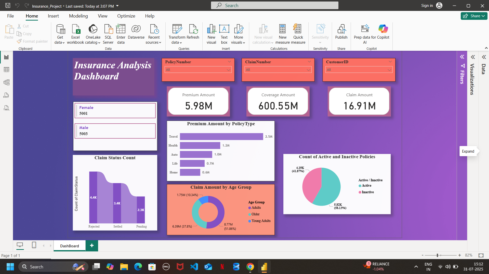

# 📊 Insurance Dashboard - Power BI

An interactive **Power BI report** created for **Fictional Insurance Pvt. Ltd**, designed to visualize insurance claim data, customer demographics, policy activity, and key business metrics.

---

## 🔄 Project Workflow

1. **Data Import**
   - Source: Microsoft SQL Server
   - Table: `InsuranceData`

2. **Data Preparation**
   - Cleaned and corrected data types using **Power Query Editor**
   - Renamed columns and structured data for better insights

3. **Dashboard Creation**
   - Used slicers, cards, bar charts, pie charts, and donut charts
   - Applied a visually engaging and professional layout

---

## 📌 Key Visuals

- **Gender Count Cards**
  - Displays total number of Male and Female customers

- **Slicers**
  - Filter the data by `PolicyNumber`, `ClaimNumber`, and `CustomerID`

- **Card's**
  - **Premium Amount**: 5.98M  
  - **Coverage Amount**: 600.55M  
  - **Claim Amount**: 16.91M

- **Bar Chart**
  - Premium distribution by Policy Type (Travel, Health, Auto, etc.)

- **Column Chart**
  - Count of Claim Status (Rejected, Settled, Pending)

- **Donut Chart**
  - Claim Amount by Age Group (Adults, Older, Young Adults)

- **Pie Chart**
  - Active vs Inactive Policy Count

---

## ▶️ How to Use

1. Open the `.pbix` file in **Power BI Desktop**
2. Use the slicers to filter data dynamically
3. Hover over visuals to view tooltips with detailed insights

---

